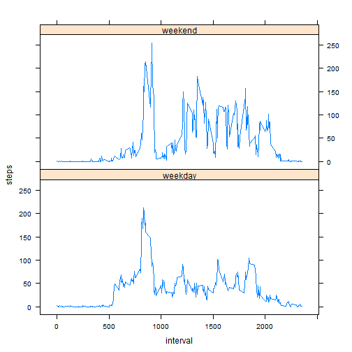

Peer Assignment 1 / Reproducable Research
============================


Reading in the activity data into a data frame and changing the date variable to R date:

```r
d<-read.csv("activity.csv", header=TRUE, na.strings = "NA")
d$date <- as.Date(d$date, format = "%Y-%m-%d")
```


## A. What is mean total number of steps taken per day?


First lets look at a histogram of the total number of steps each day: 

```r
s <-aggregate(steps ~ date, data=d, FUN=sum, na.rm=FALSE)
hist(s$steps , col = "red", xlab = "Date", ylab = "Steps", 
 main = "Mean Number of steps per day")
```

 

Now looking at mean an median:

```r
mn<-format(mean(s$steps), scientific=FALSE)
md<-format(median(s$steps), scientific=FALSE)
```
The mean is 10766 and the median is 10765.
So they are very close to each other. 

## B. What is the average daily activity pattern?

The pattern averaged over all days looks like this:

```r
curve<-aggregate(. ~ interval, data=d, FUN=mean, na.rm=FALSE)
plot(curve$interval, curve$steps,  type = "l", 
  ylab = "Steps", xlab = "Interval",  
  main = "Number of steps per Interval")
```

 


To find the  maximum number of steps we calculate:

```r
mi<-which(curve$steps==max(curve$steps))
maxstep<-curve[mi,2]
```
So the maximum is 206.1698 and can be found in row 104.

## C. Imputing missing values

In order to find the number of missing values in the steps variable we calculate:

```r
NArownr<- sum(is.na(d$steps))
```
and find a total number of 2304 rows with missing data.

To impute those missing values we will now replace them by the mean values for the according interval. To be sure we first check these variable for missing values to prevent replacing missings with missings. So are there missings present in the interval means of step numbers:


```r
check<-any(is.na(curve$steps))
```
The Result is FALSE, which means there are no missings present and we can use these variable.


So we will first copy the steps variable into a new variable names 'steps_imped'

```r
d<-cbind(d,d$steps)
colnames(d)<-c("steps", "date", "interval", "steps_imped")
```

Next we create an Index of the rows with missings:


```r
NArows<-which(is.na(d$steps))
```

And create a lookup of the values we will use for the imputation

```r
impval <- vector(mode="list", length=length(curve$interval))
impval <- curve$steps
names(impval) <- curve$interval
```

Now we can impute the missings:

```r
hlp <- impval[match(d$interval, names(impval))]
d$steps_imped[NArows] <- hlp[NArows] 
```

In order to create a new dataset that is equal to the original dataset but with the missing data filled in, we only have to drop the original step variable:

```r
dimputed=d[,c(2,3,4)]
```


Now recalculating the histogram of total steps per day 

```r
si <-aggregate(steps_imped ~ date, data=dimputed, FUN=sum, na.rm=FALSE)
hist(si$steps_imped, col = "red", xlab = "Date", ylab = "Steps", 
     main = "Number of steps per day")
```

 

shows only minor differences to the histogram before imputation.

Also the mean and median, based on the imputed variables 

```r
mni<-format(mean(si$steps_imped), scientific=FALSE)
mdi<-format(median(si$steps_imped), scientific=FALSE)
```
mean (imputed) is 10766 and median (imputed) is 10766.
have changed very little compared to the values without imputation
(mean 10766 and median 10765).


# D. Are there differences in activity patterns between weekdays and weekends?

To categorize the dates into "weekday" and "weekend" we add a new variable 'category' to the data set:


```r
category <- sapply(dimputed$date, function(x) {
  if (weekdays(x) == "Samstag" | weekdays(x) == "Saturday")
    return("weekend")
  else
    return("weekday")
})
dimputed <- cbind(dimputed, category)
```

Aggregating the data over the intervals for the weekdays and weekends separately allows us to plot a comparison:


```r
wcurve<-aggregate(dimputed$steps_imped, data=dimputed, by = list(category, dimputed$interval), mean)
colnames(wcurve)<-c("category","interval","steps")

library(lattice)
xyplot(steps ~ interval | category, data=wcurve, layout=c(1,2), type="l")#, 
```

 

which shows significantly more activity (i.e. steps) in the afternoon on weekends than on weekdays.


